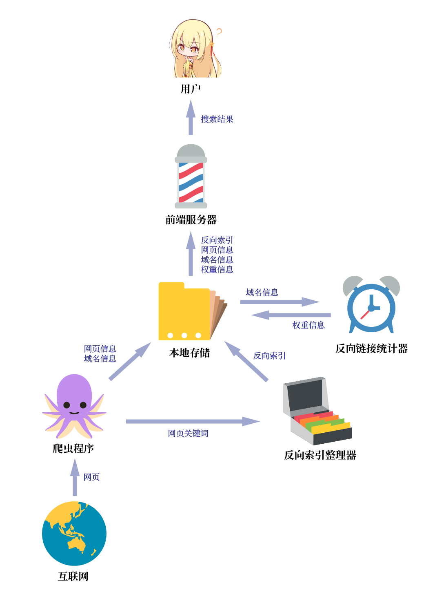

# sese-engine设计文档

sese-engine主要分为6个部分: 

- 爬虫程序

    它24小时都在上网。是现代大学生的榜样。

- 反向索引整理器

    它将爬虫程序收集到的关键词整理成反向索引。

- 反向链接统计器

    它根据各个域名的出站链接为域名计算权重。

- 本地存储

    它负责把收集到的各种信息写到硬盘上。

- 前端服务器
 
    它接收用户的请求并返回搜索结果。

- 用户

    它通常是1个人类。但也可以不是。

## 爬虫程序

爬虫程序本质上是一个无限BFS程序。

把每个URL当作一个节点，URL到另外一个URL的链接当作边，它就是在这个图上跑BFS。不过这个BFS的队列很容易就会爆内存，所以在每次把1距离的节点全都访问完时，就会把队列中的节点加权随机丢弃。

当URL被访问到时，会将这个网页的信息还有域名的信息实时储存在硬盘上，接下来把这个网页中的词频塞到队列里，给反向索引整理器处理。

## 反向索引整理器

反向索引整理器就是用来生成反向索引的。

它是一个本地服务器，用http的形式接收来自爬虫程序的输入。

反向索引就是每1个词对应n个相关的URL，而反向索引整理器收到的输入是每1个URL对应n个词。所以要把词和URL反过来，然后经过筛选、排序，最后写入本地存储中。

## 反向链接统计器

反向链接统计器用于统计URL的热度。

这是一个定时任务，耗费资源很多，所以需要定时在半夜执行。

其他域名引用这个URL越多，这个URL的热度就越高。反向链接统计器会遍历本地存储中所有域名的出站链接，然后在对应的URL上做累加，最后将高热度的URL写入JSON文件。

## 本地存储

本地存储是直接写在文件系统里的。

本地存储不是一个独立服务，它是组件，因此不是进程安全的。

它为其他各个组件提供一个通用的k-v存取接口。此外也定义了一些特殊的压缩和序列化的方法。

## 前端服务器

前端服务器是用户直接与搜索引擎交互的服务器。

前端服务器接收来自用户的查询，将一个查询进行分词、找索引、筛选、排序、获取摘要，之后把搜索结果返回给UI用于渲染。

前端服务器不包括UI本身，UI在[YunYouJun/sese-engine-ui](https://github.com/YunYouJun/sese-engine-ui)，是由GitHub Pages提供的服务。

## 用户

用户通常是智人种的动物，但有时也可以是机器人、舰娘、狗、魅魔等具有一定智能的对象。
